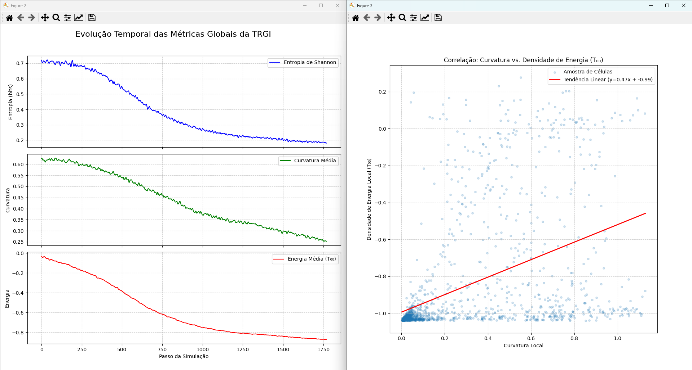

# 🌌 TRGI Simulator — Geometric-Informational Reality Theory

A computational simulator based on the **Geometric-Informational Reality Theory (TRGI)** — a speculative framework where **quantum information** is the fundamental substrate of the universe, and **spacetime, energy, and matter** are emergent phenomena.

This Python-based project combines **interactive visualization**, **quantum dynamics simulation**, and **metric analysis** of emergent curvature and energy density.

---

## 📜 Table of Contents

- [🔭 Theory Overview](#-theory-overview)
- [🧠 Simulation Design](#-simulation-design)
- [📊 Metrics Tracked](#-metrics-tracked)
- [🛠️ Requirements & Installation](#️-requirements--installation)
- [🚀 How to Run](#-how-to-run)
- [📁 Project Structure](#-project-structure)
- [🎞️ Example Results](#-example-results)
- [📚 References & Inspirations](#-references--inspirations)
- [🤝 Contributions](#-contributions)

---

## 🔭 Theory Overview

The TRGI hypothesis suggests:

1. **Quantum information (`Ψ_I`) is fundamental**, modeled here as a grid of qubits (infons).
2. **Spacetime geometry emerges** from the organization of that information, computed via local angular distances between qubit states (Bloch vectors).
3. **Energy and particles** are interpreted as stable or localized patterns in the information field. The energy-momentum tensor `T_{μν}` becomes a tensor of informational density.
4. **A causal feedback cycle** governs dynamics:
   - Geometry influences qubit dynamics (via coupling `J_eff`).
   - Qubit dynamics, in turn, reshape the geometry.

---

## 🧠 Simulation Design

- 2D periodic grid of qubits (`40x40` default).
- Each qubit evolves using a local Hamiltonian (Transverse Ising model):

  ```math
  H_{ij} = -J_{eff} · Z_i ⊗ Z_j - h · (X_i ⊗ I + I ⊗ X_j)
  ```

- **Emergent curvature** is calculated as the standard deviation of informational distances to 8 neighbors.
- **Informational energy density** `T₀₀` is the local Hamiltonian expectation value.
- The coupling `J_eff` varies with local alignment (curvature): stronger in flatter regions.

---

## 📊 Metrics Tracked

- **Shannon entropy** (global informational order)
- **Average curvature** (emergent geometry)
- **Average energy** (`T₀₀`)
- **Local correlation** between curvature and energy (scatter plot + linear regression)

---

## 🛠️ Requirements & Installation

```bash
git clone https://github.com/yourname/TRGI-simulator.git
cd TRGI-simulator
pip install -r requirements.txt
```

Main dependencies:
- Python 3.10+
- `numpy`
- `matplotlib`
- `scipy`

---

## 🚀 How to Run

To open the interactive GUI with live visualization:

```bash
python gui/interactive_sim_mpl.py
```

Or to run plots from saved results:

```python
from core.analysis import plot_history, plot_correlation
```

---

## 📁 Project Structure

```
TRGI-simulator/
│
├── core/
│   ├── manifold.py
│   ├── infon_qubit.py
│   ├── dynamics.py
│   ├── geometry.py
│   ├── t_tensor.py
│   ├── metrics.py
│
├── gui/
│   └── interactive_sim_mpl.py
│
├── config/
│   └── default_params.json
│
├── results/
└── README.md
```

---

## 🎞️ Example Results

### 🔄 Live Simulation Preview


### 📊 Global Metrics



### 📈 Simulation Metrics Overview

#### 🧩 Left Panel — Global Metrics Over Time

1. **Shannon Entropy (bits)**  
   Measures the level of disorder in the quantum information field.  
   → A steady decrease indicates increasing global order over time.

2. **Average Curvature**  
   Reflects the emergent geometric structure based on local qubit alignment.  
   → A declining trend suggests the formation of more regular, low-curvature regions.

3. **Average Energy (T₀₀)**  
   Represents the informational energy density (expected value of the local Hamiltonian).  
   → Shows progressive energy dissipation as the system stabilizes.

#### 📊 Right Panel — Local Correlation

**Curvature vs. Energy Density (T₀₀)**

- Each point represents a cell in the grid, plotted by its local curvature and energy.
- The red regression line reveals a **positive linear trend**:  
  → `T₀₀ ∝ curvature` — high-curvature regions tend to have higher energy,  
    validating the **feedback mechanism** predicted by the TRGI model.

---

### 🧪 Phases Observed

- **Ordered Phase (h = 0.2):**
  - Domains of aligned qubits.
  - Significant drop in entropy and energy.
  - Strong positive correlation:
    ```math
    T_{00} ∝ curvature
    ```


---

## 📚 References & Inspirations

- John Wheeler – "It from Bit"
- Carlo Rovelli – Relational Quantum Mechanics
- Erik Verlinde – Emergent Gravity
- Quantum computing & Ising models
- Self-organizing systems and cellular automata

---

## 🤝 Contributions

This is a one-person exploratory project created by a developer with a passion for physics, supported by AI tools.

If you're a physicist, computer scientist, or simply curious about simulated universes — feel free to reach out!

**Author:** Erik Mendes  
**License:** MIT
